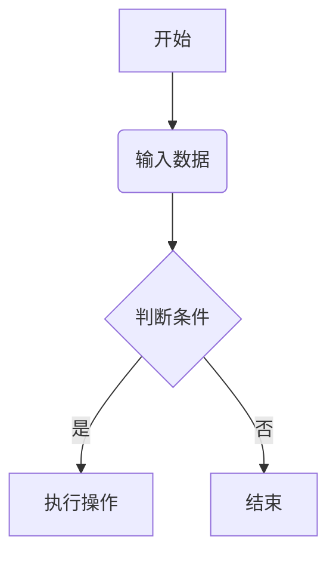

$$
\int_{a}^{b} x^2 dx
$$
?

```mermaid
graph TD
    A[开始] --> B(输入数据)
    B --> C{判断条件}
    C -->|是| D[执行操作]
    C -->|否| E[结束]
```
?
Q: TCP 三次握手的过程？
A: 1. SYN → 2. SYN-ACK → 3. ACK
#deep
<!--SR:!2025-02-02,1,230-->
